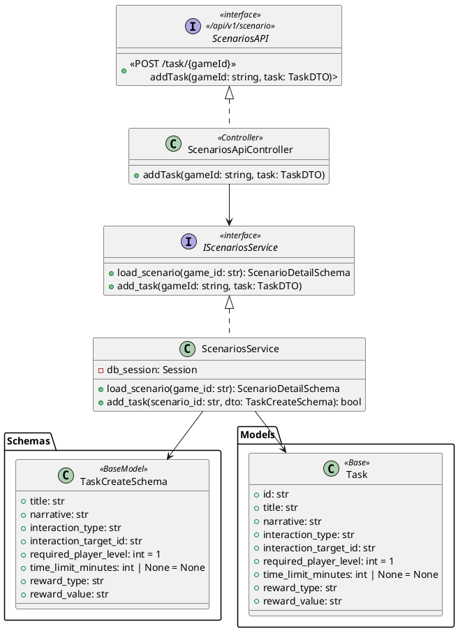

```plantuml
@startuml
interface ScenariosAPI <<interface>>\n<< /api/v1/scenario >> {
    + <<POST /task/{gameId} >>\n\taddTask(gameId: string, task: TaskDTO)>
}

class ScenariosApiController <<Controller>> implements ScenariosAPI {
    + addTask(gameId: string, task: TaskDTO)
}

interface IScenariosService <<interface>> {
     + load_scenario(game_id: str): ScenarioDetailSchema
     + add_task(gameId: string, task: TaskDTO)
}

class ScenariosService implements IScenariosService{
     - db_session: Session
     + load_scenario(game_id: str): ScenarioDetailSchema
     + add_task(scenario_id: str, dto: TaskCreateSchema): bool
}


package "Schemas" {
    class TaskCreateSchema <<BaseModel>> {
        + title: str
        + narrative: str
        + interaction_type: str
        + interaction_target_id: str
        + required_player_level: int = 1
        + time_limit_minutes: int | None = None
        + reward_type: str
        + reward_value: str
    }
}

package "Models" {

class Task <<Base>> {
        + id: str
        + title: str
        + narrative: str
        + interaction_type: str
        + interaction_target_id: str
        + required_player_level: int = 1
        + time_limit_minutes: int | None = None
        + reward_type: str
        + reward_value: str
}

}

ScenariosService -->TaskCreateSchema
ScenariosApiController --> IScenariosService
ScenariosService --> Task
@enduml
```
