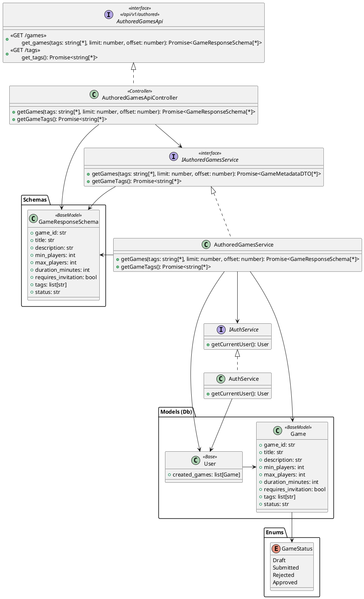
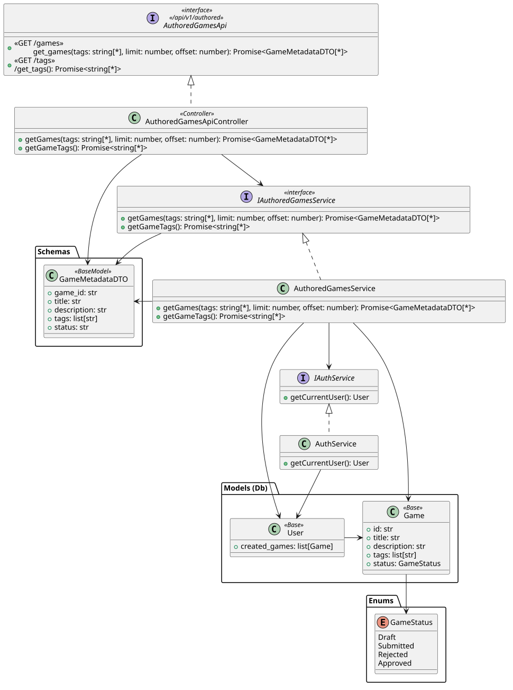

```plantuml
@startuml
interface AuthoredGamesApi <<interface>>\n<< /api/v1/authored >> {
    + <<GET /games >>\n\tget_games(tags: string[*], limit: number, offset: number): Promise<GameResponseSchema[*]>
    + <<GET /tags >>\n\tget_tags(): Promise<string[*]>
}

class AuthoredGamesApiController <<Controller>> implements AuthoredGamesApi {
    +getGames(tags: string[*], limit: number, offset: number): Promise<GameResponseSchema[*]>
    +getGameTags(): Promise<string[*]>
}

class AuthoredGamesService implements IAuthoredGamesService {
    +getGames(tags: string[*], limit: number, offset: number): Promise<GameResponseSchema[*]>
    +getGameTags(): Promise<string[*]>
}

interface IAuthService {
    + getCurrentUser(): User
}

class AuthService implements IAuthService {
    + getCurrentUser(): User
}


package "Models (Db)" as models {

    class Game <<BaseModel>> {
        + game_id: str
        + title: str
        + description: str
        + min_players: int
        + max_players: int
        + duration_minutes: int
        + requires_invitation: bool
        + tags: list[str]
        + status: str
    }
    
    class User <<Base>> {
        + created_games: list[Game]
    }
}

interface IAuthoredGamesService <<interface>> {
    +getGames(tags: string[*], limit: number, offset: number): Promise<GameMetadataDTO[*]>
    +getGameTags(): Promise<string[*]>
}

package "Enums"{
    enum GameStatus {
        Draft
        Submitted
        Rejected
        Approved
    }
}

package "Schemas" {
    class GameResponseSchema <<BaseModel>> {
        + game_id: str
        + title: str
        + description: str
        + min_players: int
        + max_players: int
        + duration_minutes: int
        + requires_invitation: bool
        + tags: list[str]
        + status: str
    }
}

AuthoredGamesApiController --> IAuthoredGamesService
User -> Game
Game --> GameStatus
AuthoredGamesApiController -> GameResponseSchema
IAuthoredGamesService -> GameResponseSchema
AuthoredGamesService -> GameResponseSchema
AuthoredGamesService --> IAuthService
AuthoredGamesService --> User
AuthService --> User
AuthoredGamesService --> Game

@enduml
```

